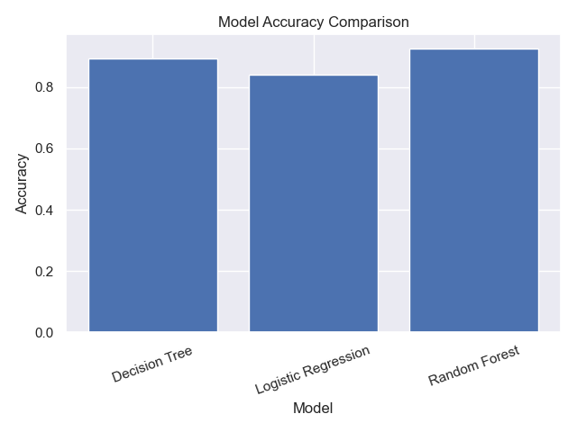
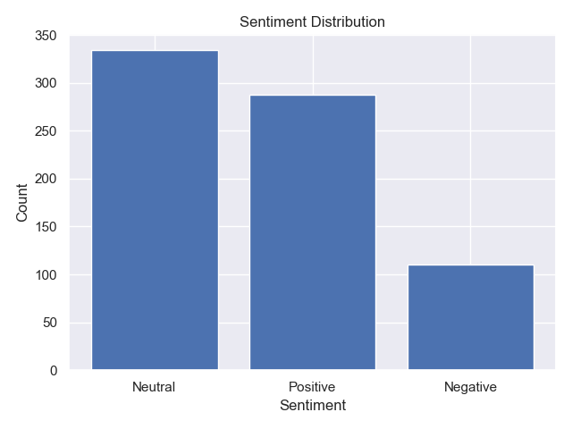

# Data Analytics Projects (Python)

This repository contains data analytics tasks completed as part of a structured learning program. The focus of this project is to apply data analysis techniques using Python and gain hands-on experience with real-world data.
---

## Level 1 Tasks

### Task 1: Data Cleaning and Preprocessing

* Loaded raw dataset using pandas
* Handled missing values (removal/imputation)
* Removed duplicate records
* Standardized inconsistent data formats
* Exported cleaned dataset for further analysis

---

### Task 3: Basic Data Visualization

* Created visualizations such as:

  * Line charts
  * Bar plots
  * Scatter plots
* Customized titles, labels, and legends
* Exported plots as images for reporting

Output:
- price_trend.png  
- monthly_avg_price.png  
- open_vs_close.png

## Tools
Tools:
- Python
- pandas
- matplotlib
- seaborn
---

## Level 2 Tasks

### Task 1: Regression Analysis

* Used House Prediction dataset but the cells were all messed up so I had AI fix it(all the columns were in column A)
* Performed data inspection and basic cleaning (handling missing values like level 1 task 1)
* Split dataset into training 80% and testing 20% sets  
* Applied Linear Regression using scikit-learn  
* Evaluated model using:
  * R^2 Score to find how well the model predicts
  * Mean Squared Error (MSE) to find how well the model makes mistakes
* Interpreted model coefficients
* Visualized actual vs predicted values using a scatter plot

Output:
- regression_plot.png 

### Task 3: Clustering Analysis (K-Means)

* Used Iris dataset  
* Removed the last column called species since it was in text form and not numerical
* Standardized features using StandardScaler  
* Applied K-Means clustering
* Set optimal number of clusters using the Elbow Method  
* Visualized clusters using 2D scatter plot

Output:
- elbow_method.png  
- iris_clusters.png  

## Tools
Tools:
- Python
- pandas
- matplotlib
- seaborn
- scikit-learn
---

## Level 3 Tasks

### Task 1: Predictive Modeling (Classification)

* Used churn dataset to predict whether a customer will leave or not
* Cleaned the data
* Converted categorical data into numerical values
* Split dataset into training (80%) and testing (20%)  
* Applied multiple classification models such as:
  * Decision Tree
  * Logistic Regression
  * Random Forest
* Evaluated model performance using:
  * Accuracy
  * Precision
  * Recall
  * F1 Score
* Compared model performance using a bar chart
* Performed hyperparameter tuning using GridSearchCV to improve model performance

Output:
- model_comparison.png  

### Task 3: Sentiment Analysis (NLP)

* Used sentiment dataset containing text data
* Performed text preprocessing including:
  * Tokenization
  * Removing stopwords
  * Lemmatization
* Applied sentiment analysis using TextBlob
* Classified text into Positive, Negative, and Neutral categories
* Visualized sentiment distribution using a bar chart
* Visualized word frequencies using a word cloud

Output:
- sentiment_distribution.png  
- word_frequencies.png  

Tools:
- Python
- pandas
- matplotlib
- seaborn
- nltk
- textblob
- wordcloud

---
## Project Structure

```

data-analytics-projects/

  Data/
    stock_prices.csv
    cleaned_stock_prices.csv
    house_Prediction_Data_Set.csv
    iris.csv

  Level1/
    task1_data_cleaning.py
    task3_visualization.py
    Plots/
      price_trend.png
      monthly_avg_price.png
      open_vs_close.png

  Level2/
    task1_regression.py
    task3_clustering.py
    Plots/
      regression_plot.png
      elbow_method.png
      iris_clusters.png

  Level3/
    task1_classification.py
    task3_sentiment_analysis.py
    Plots/
      model_comparison.png
      sentiment_distribution.png
      word_frequencies.png

  README.md
  requirements.txt

```
## Visualizations of Plots folder

### Level 1 Visualizations

#### Stock Price Trend


#### Average Monthly Closing Price


#### Open vs Close Price


---

### Level 2 Visualizations

#### Regression Plot (Actual vs Predicted Prices)


#### Elbow Method (Optimal Clusters)


#### Iris Clusters Visualization


---

### Level 3 Visualizations

#### Model Accuracy Comparison


#### Sentiment Distribution


#### Word Frequencies

---

## How to Run the Project

1. Clone the repository:
git clone [repo link]

2. Navigate into the project folder:
cd data-analytics-projects

3. Install dependencies:
pip install -r requirements.txt

4. Run the scripts:

Level 1:
python Level1/task1_data_cleaning.py
python Level1/task3_visualization.py

Level 2:
python Level2/task1_regression.py
python Level2/task3_clustering.py

Level 3:
python Level3/task1_classification.py
python Level3/task3_sentiment_analysis.py

---

## Dataset

These datasets are in Data folder:

* stock_prices.csv - used for Level 1
* cleaned_stock_prices.csv - cleaned version of the stock prices dataset
* house_Prediction_Data_Set.csv - used for Level 2
* iris.csv - used for Level 2
* churn-bigml-80.csv - used for Level 3

These datasets are used for data cleaning, visualization, regression, clustering, and classification tasks.

---

## Reflection

* For Level 1, I learned how to stregthen my skills regarding datsets by improving my understanding of handling missing values, formatting data, and presenting insights visually and how to plot and visualize graphs in a cleaner way.
* In Level 2, I learned how to apply machine learning techniques such as Linear Regression and K-Means clustering in a more professional manner. I now gained experience in evaluating models using R² score and learned to use MSE and visualizing results to understand model performance.
* In Level 3, I learned how to work with text data using natural language processing techniques such as tokenization, removing stopwords, and lemmatization. I also learned how to perform sentiment analysis using TextBlob and evaluate results using accuracy, precision, recall, and F1 Score. This helped me understand how machine learning can be applied to both structured and unstructured data.
---

## Author

**Mohammad Salehi**
– Information Technology year 1 at Middlesex University Dubai

---

## Notes

This repository reflects my learning and development in data analytics using Python. The work was completed as part of a structured learning program, where I gained hands-on experience in data cleaning, visualization, machine learning, and natural language processing.
